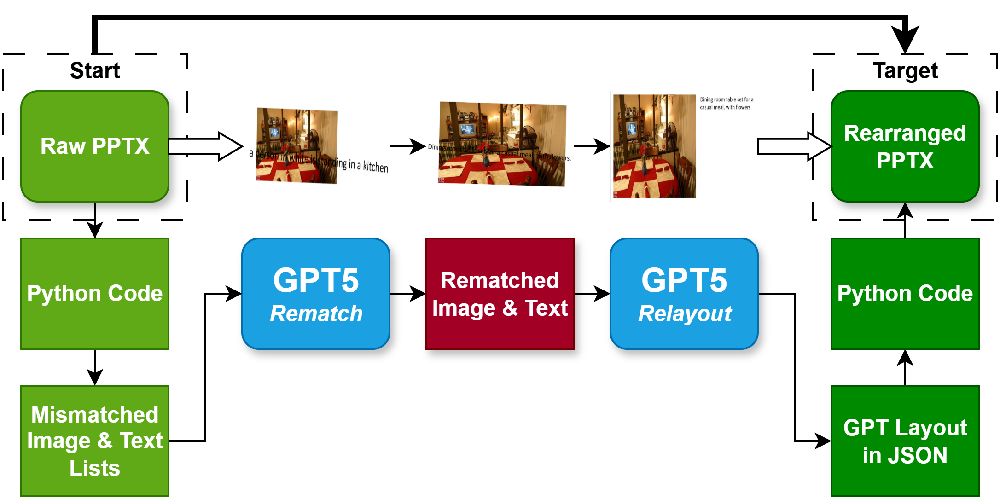

# Instruction-Slide-Editing

This repository is a demo showcasing how **Instructed GPT-5** can be applied to automatically rearrange the layout of text and images in `.pptx` slides.

In current LLM-assisted slide generation pipelines, outputs often suffer from **caption–image mismatches** and **random, cluttered layouts**, due to the lack of structural understanding of slide composition. While prior works (e.g., [Talk-to-Your-Slides](https://github.com/KyuDan1/Talk-to-Your-Slides)) have explored LLM assistance for editing or augmenting slide content, **few have explicitly focused on the spatial layout problem**—how to arrange text and images coherently within slides.

This demo aims to illustrate a workflow in which an instructed multimodal LLM is tasked to:
- Match images with their correct captions.
- Normalize orientation (e.g., remove unwanted rotations).
- Generate layout plans that respect margins, avoid overlaps, and produce visually clear two-column arrangements.

The pipeline highlights GPT-5’s capability to reason about both text and image elements and to generate layout instructions in structured JSON, which are then executed to relayout the slides.  

An overview of the process is shown in the diagram below:



## Setup

To run this demo, please set up an Anaconda environment and install dependencies:

```bash
pip install -r requirements.txt
```

This demo uses **GPT-5** as the LLM.  
To run the demo, create a `.env` file in the project root and add the following, replacing the placeholder with your own API key:

```bash
OPENAI_API_KEY=your_openai_api_key_here
OPENAI_MODEL=gpt-5
```

This demo uses the [MS COCO (Common Objects in Context)](https://cocodataset.org/#home) image–caption dataset to generate raw `.pptx` input slides. These input slides intentionally contain __mismatched image–caption pairs__ and __randomized layouts__.  

An example input deck can be found at `slides/coco_raw.pptx`. To preprocess and generate such input slides, run:

```bash
python preprocess.py --images 20 --captions 20 --out slides/coco_raw_20.pptx --skip_broken
```

After generating the `.pptx` file above, you can run the demo in `slidedit`. The demo rearranges slides in two stages: **Rematch** and **Relayout**. Rearranged slides after each stage can be found at `slides/coco_rematched.pptx` and `slides/coco_relayout.pptx`.

## Limitations

Since this is only an initial demo, some limitations include:

1. The current pipeline only processes information that can be extracted into JSON. In real-world slides, additional attributes (e.g., embedded images, PDFs, complex objects) may appear and would require more advanced handling. This observation suggests potential future work, but is outside the scope of this demo.

2. In this demo, the instruction used for layout planning is explicitly provided in the `.ipynb`. More advanced prompt-engineering techniques could make the instructions more concise without sacrificing performance, which is another possible direction for refinement.